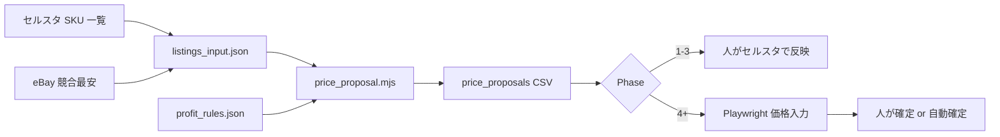

# 価格調整 自動化フロー設計

## 目的

セルスタ経由の eBay 出品について、**最安 − 0.01 USD** と **利益率 1%** を満たす価格案を生成し、段階的に反映まで自動化する。

**実務の正**は `セルスタ実務フロー_UK基準.md`（競合 total の取り方、利益計算で送料$=0・DDP=0 にする UK 試算、Shipping Policy の 50 USD 帯、更新後 DDP=25 に戻す手順）。

---

## データフロー



---

## 利益計算（実装の前提）

`lib/profit_calc.mjs` は次を **設定可能** にしている（`profit_rules.sample.json`）。

1. **売上（JPY）**  
   `(itemPriceUsd + shippingChargedUsd) * fxUsdJpy * (1 - ebayFeeRate) - fixedFeeUsd * fxUsdJpy`

2. **コスト（JPY）**  
   `costJpy + outboundShippingJpy`（必要なら `packagingJpy` 等を追加）

3. **純利益（JPY）**  
   `revenueJpy - costJpy`（還付金は加算しない）

4. **利益率**  
   デフォルト：`netProfitJpy / costJpy * 100`（`marginDenominator: "cost"`）  
   セルスタ表示が販売価格ベースなら `marginDenominator: "revenue"` に変更。

**重要**：セルスタの「利益」列と **必ず突合** してから一括運用する。

---

## 価格提案ロジック

```
competitiveTotal = competitorLowestTotalUsd
targetTotal = competitiveTotal - 0.01
targetItemPrice = targetTotal - shippingChargedUsd

if profit(targetItemPrice) >= minMarginPercent:
  action = currentTotal > targetTotal ? "lower" : (currentTotal < targetTotal ? "raise" : "hold")
  proposed = targetItemPrice
else:
  proposed = max item price where profit >= minMargin  // floor
  if proposed > current: action = "raise"
  elif proposed < current: action = "hold"  // 最安には届かないがこれ以上下げない
  else: action = "hold"
```

値上げ：`currentTotal` が `targetTotal` より **0.01 以上安い** とき、かつ提案価格で利益率を満たす場合（無駄な値下げを避ける）。

---

## Playwright（Phase 2 以降）

`05_発送ラベル作成` と同型。

### Phase A（先に作る）

- ログイン：人
- セルスタで SKU 行 → 「eBay で確認」→ 競合一覧または最安表示を **dump / scrape**
- 価格変更は **しない**

### Phase B

- セッション保存（`storageState`）でログイン省略（2FA 時は手動待ち）

### Phase C

- `listings_input.json` をキュー処理
- 失敗は `needs_review`、成功は CSV + ログ

セレクタファイル：`playwright_selectors_sellsta.sample.json`（未作成時は Phase 2 で追加）

---

## ログ仕様（最小）

| フィールド | 内容 |
|------------|------|
| `runId` | 日時ベース |
| `sku` | |
| `status` | `proposed` / `applied` / `skipped` / `failed` |
| `currentPriceUsd` | |
| `proposedPriceUsd` | |
| `competitorLowestTotalUsd` | |
| `profitMarginPercent` | |
| `reason` | |

---

## 着手順（実装）

1. ✅ `lib/profit_calc.mjs` / `lib/price_proposal.mjs`
2. ✅ `run_price_proposal.mjs` + PowerShell ラッパー
3. セルスタと 10 SKU 突合 → `profit_rules.json` 確定
4. `autofill_sellsta_price_scan_playwright.mjs` 雛形
5. `run_pricing_cycle.ps1` で scan → propose 連結

---

## リスクと対策

| リスク | 対策 |
|--------|------|
| 最安の取り違え（状態・付属品違い） | 手動確認列、初月は hot SKU のみ自動 |
| 為替・手数料のズレ | `fxUsdJpy` を週次更新、突合ログ |
| アカウント制限 | スキャン間隔、1 日あたり上限 |
| 過度な値下げ | 0.01 ルール厳守、floor で hold |
| ポリシー | 反映は Phase 4 まで人の確定（`運用ポリシー.md`） |
